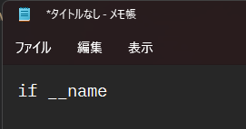
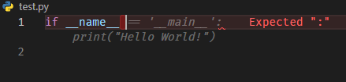

# **プログラミング環境構築学概論**
<!-- _class: lead -->

## この講習は何

- 情報系講義が増えてきたので、
少しでも快適な環境を手に入れてほしい

- 環境構築まわりのあれこれから実際に構築するところまでやります

## 前提環境

- Windows10(バージョン2004以降)もしくはWindows11
- macOSやLinuxの場合は、途中まで聞き流してください

## 事前準備

### GitHubのアカウントを作っておいてください

- 大学のメールアドレスを登録して作ると
何かと恩恵を受けられます。
- しばらくは導入部分なので聞きながらやってもらってOK

## おしながき

- 環境構築とは何なのか
- コードエディタを使う利点
- WSLのすゝめ
- 環境構築をしよう
  - Ruby
  - LaTeX
  - (Python)

## 環境構築とは

## 環境構築とは

- とりあえずVSCode入れればOKやろ！😁

## 環境構築とは

- とりあえずVSCode入れればOKやろ！😁
→ 実は入れただけで動くわけではなく、
事前にいろいろなもののインストールや設定が必要

## 環境構築とは

- とりあえずVSCode入れればOKやろ！😁
→ 実は入れただけで動くわけではなく、
事前にいろいろなもののインストールや設定が必要

```bash
sudo apt-get update; sudo apt-get install make build-essential libssl-dev zlib1g-dev \
libbz2-dev libreadline-dev libsqlite3-dev wget curl llvm \
libncursesw5-dev xz-utils tk-dev libxml2-dev libxmlsec1-dev libffi-dev liblzma-dev
```

<div style="font-size:18pt">例: Pythonの環境をLinuxに構築する場合の下準備</div>
<br>
<div style="text-align: center;">
    <b>この「事前のインストールや設定」が</b><br>
    <b><u>環境構築=難しい</u>のイメージを作っている</b>
</div>

## なぜエディタで書くのか？

効率良く書くための専用の機能が数多くある

 &emsp;&emsp;
<div style="font-size:18pt">メモ帳でPythonを書く場合&emsp;&emsp;&emsp;&emsp;VSCodeでPythonを書く場合</div>

行番号や変数名の補完、ifなどの語句の色付けなど、
見やすく楽に書くことができる！

## 余談: おすすめのコードエディタ

1. Atom

- GitHubが開発
- OSを問わず使える
- 後述するVSCodeとできることはほぼ同じ
- 最近はほぼアップデートされなくなったので非推奨

## 余談: おすすめのコードエディタ

2. VSCode

- Microsoftが開発
- OSを問わず使えるが、Windowsで使うと特に便利
- 拡張機能による柔軟な機能の拡張ができる
- 頻繁なアップデート
- ユーザーが多いので記事も多く調べやすい

## 余談: おすすめのコードエディタ

3. notepad++

- メモ帳を拡張したシンプルなエディタ
- Windowsでしか使えない
- 拡張機能による柔軟な機能の拡張ができる
- とにかく軽い

## 余談: おすすめのコードエディタ

大学の演習やレポート作成を快適にやりたいなら
VSCodeが一番オススメです

## Windowsの最近の環境構築メタ

## Windowsの最近の環境構築メタ

<div style="font-size:200pt;text-align:center">WSL</div>

## WSLとは？

WSL: Windows Subsystem for Linux

Windows内に仮想環境を作ってその中でLinuxを実行する

→大学の演習環境であるLinuxに近いものをいつでも持ち運べる!

## なぜWSLなのか？

- 一般的な開発ツールはUNIX系(Linux/macOS)が前提
Windowsだけ対応が遅かったり非対応だったりすることが多々ある

- 仮想環境の利点
Windows側に影響が出ない上、簡単にLinuxだけを初期化できる

## WSLを使ってみよう

ここからしばらくは別に配布した
WSL_install.pdfを使いながら行きます

## Linuxにおけるパッケージ管理

```bash
# おさらい: sudo ≒ 管理者として実行
sudo apt update && sudo apt upgrade -y
```

- aptとは？
UbuntuなどのLinuxディストリビューションで
使われるパッケージ管理システム。
これを使ってOSに機能を追加したり削除したりする。
複数パッケージの更新などをまとめて管理できるため便利。

<div style="text-align:center;">
  <b>しかし、aptはいくつか不器用な点も抱えている</b>
</div>

## aptの不器用なところ

- 絶対に安定して動くバージョンのパッケージしかない
→OS標準のパッケージ管理システムであるがゆえ。
古いバージョンのパッケージしかない場合がある

- 便利な環境を作るためにはあまり役立たない
→OSの軽量動作を重視した結果
最低限のパッケージしか登録されていない

- OSのシステム領域にインストールするため、
なにかとsudoを要求される

## homebrewを併用しよう

- homebrewとは
主にmacOS向けに展開されているパッケージ管理システム。
実はLinux(WSLを含む)でも使用可能。

- 利点
  - aptよりもパッケージ更新頻度が高い
  - システム領域にインストールしないため
  一切sudoを要求されない
  - 新しめの開発ツールがとても多い

## homebrew導入編

別に配布したpdfに沿って進行します
